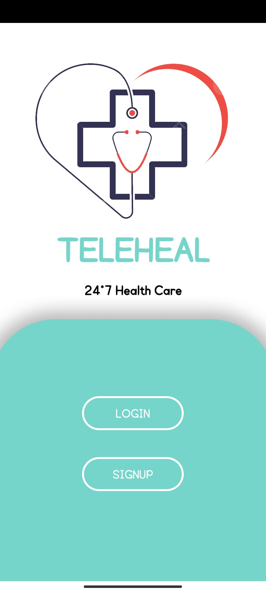
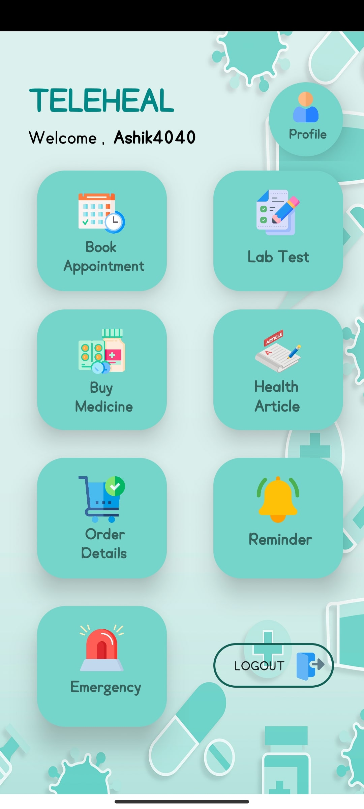
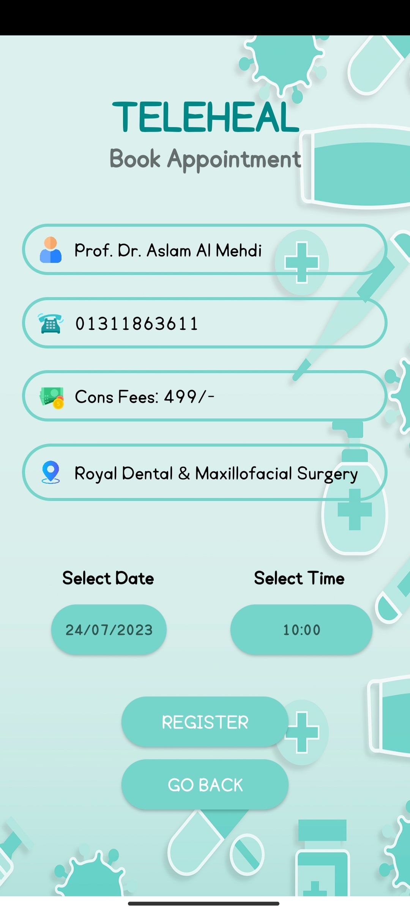
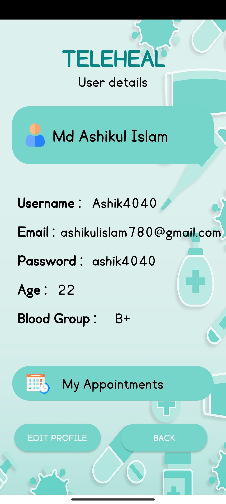
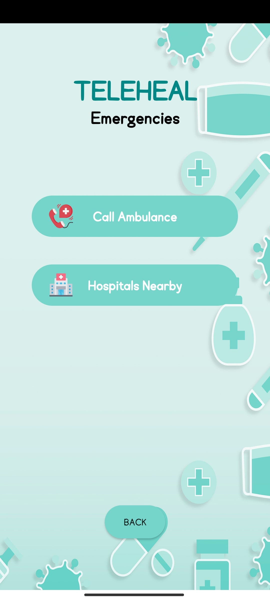

# Teleheal-24*7 Healthcare App

Our project “TeleHeal” is to build a healthcare application that will contribute to keep our body fit and healthy amidst our busy schedule. Besides it will provide shortcuts to contact different medical persons and get help to keep track of medicine intake according to their individual doses. In brief, TeleHeal will upgrade telemedicine process.

## Software Platforms

- Android Studio
- API Level 28(Android 9.0 PIE)
- FIrebase Database

## Features

- Login & SignUp
- Book Appointment
- Lab Test Booking
- Medicine Purchase
- Medicine Reminer
- Nearby Hospitals
- Call Ambulance

## UI
 Splash Page                 |     Login Page        | Home Page
:-------------------------:|:-------------------------:|:-------------------------:
||

  Find Dcotors                 |    Doctors List        | Accept Appointement
:-------------------------:|:-------------------------:|:----------------------
|)|

  User Profile                |    Emergencies Folder        | Health Articles
:-------------------------:|:-------------------------:|:----------------------
||

## Contributors

- [@Afia Fahmida](https://github.com/theta131)

- [@Samin Easar](https://github.com/samin-easar)

- [@Ashikul Islam](https://github.com/ashikulislamm)

